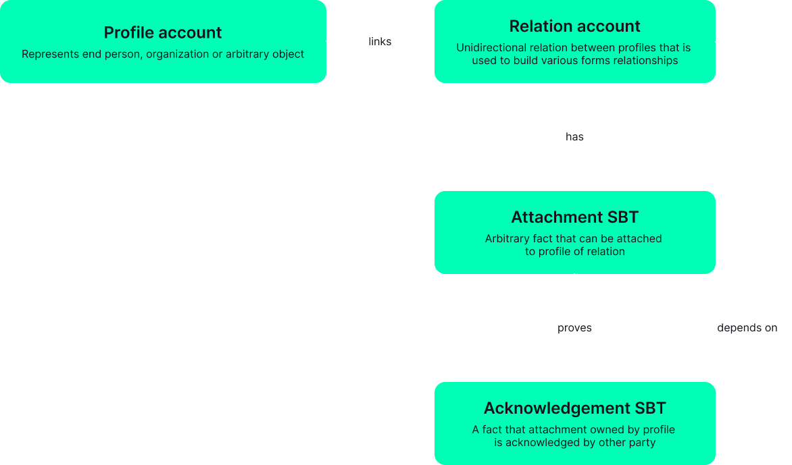

**Slink's protocol manages digital profiles. It handles relations, attachments and acknowledgements between and for profiles. Built on the Solana Blockchain.**

The protocol is generalized and designed to support various domains, e.g. HR, healthcare, traceability, supply chain, etc

- Profiles represent any entities including people, organizations, physical and digital assets
- Attachments are soul-bound tokens that represent meaningful facts associated with profiles or profile relations and may have a link to arbitrary data stored on-chain or off-chain
- Relations are variable-strength proofs of connection between parties, they are unidirectional, what brings high flexibility and variability
- Acknowledgements are soul-bound tokens that can be issued based on relations and used to create stronger proof models

